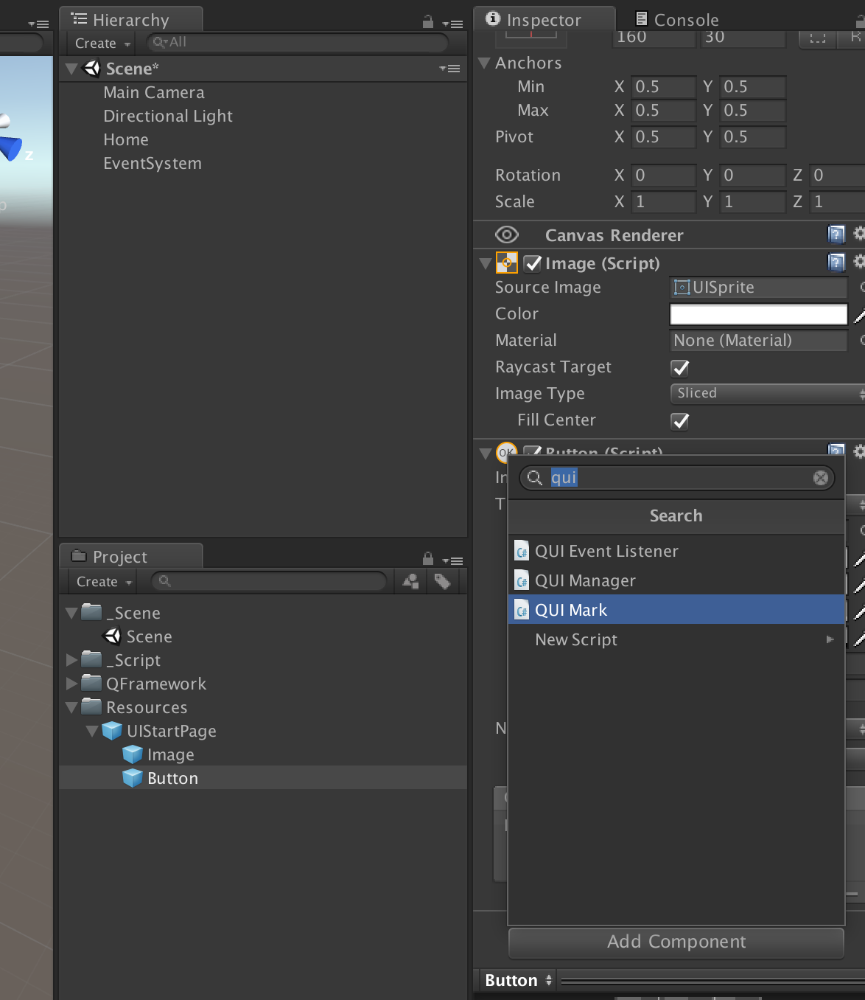
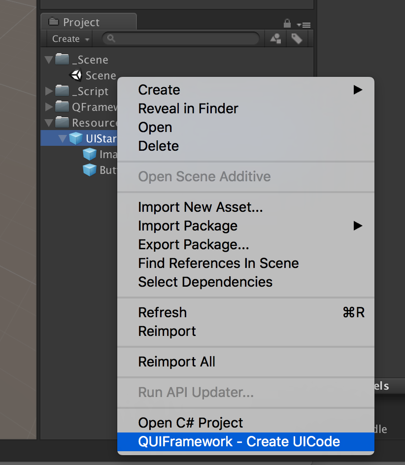
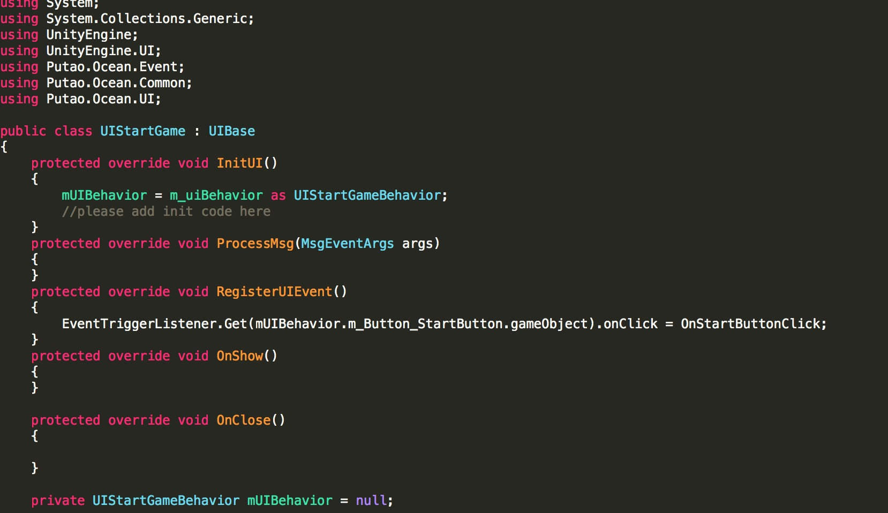
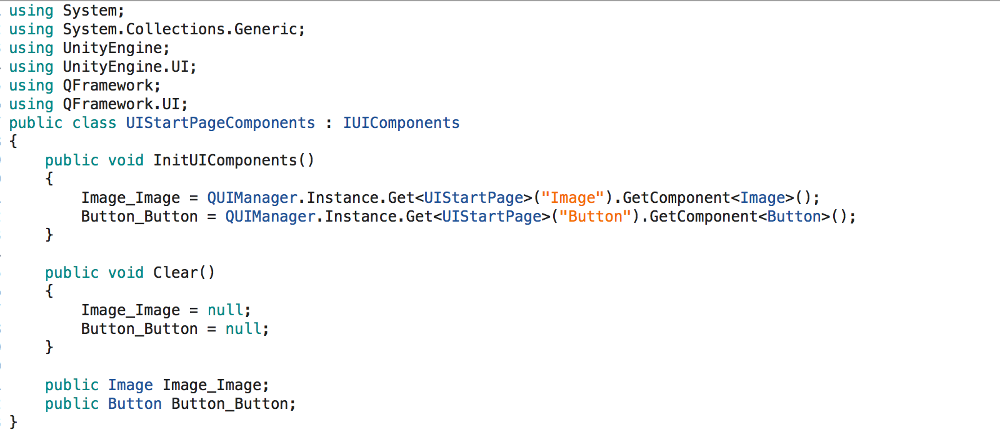

### 3.UI的制作及自动代码生成
目前大部分项目采用的ui制作方式是拖拉式（即将需要访问的对象或组件通过在Inspector面板中直接拖到脚本中的形式）或查找式（即在初始化时将需要访问的对象或组件通过Find的方式进行赋值），前者容易出现拖错而且代码查看不直观，后者一旦修改结构或名称就要修改代码。
该项目采用标记并自动生成UI代码的方式，减少出错并且方便UI控件访问并创建所有UI的基类UIBase来统一行为。
首先采用UI标识的方法将UI预制中需要在代码中操作的物体上添加一个标记，即QUIMark组件。
然后在Project中右键点击该预制，点击Create UICode可以自动生成ui代码。
&emsp;&emsp;
&emsp;&emsp;

生成的代码如下： 
1. UI逻辑类
&emsp;&emsp;
其中mUIBehavior中存储着标记了UIMark的物件，并根据其类型自动转成了相应的对象。
InitUI()，该方法可以进行一些初始化的工作
ProcessMsg(),该方法处理消息
RegisterUIEvent(),该方法用于内部触发事件的注册，如：按钮点击事件等
OnShow(),该方法界面每次显示时调用
OnClose(),该方法界面隐藏时调用
 2. QUIComponent组件类
&emsp;&emsp;
自动生成需要访问的组件，并进行初始化和销毁。
 3. QUIBehaviour类 
&emsp;&emsp;
所有自动生成的UI的基类，定义一些虚方法供子类重写。
 4. UIManager类 
所有自动生成的UI的管理类，提供一些方法来打开关闭ui：
如：UIManager.Instance.OpenUI<UIStartGame>();
   UIManager.Instance.CloseUI<UIStartGame>();
